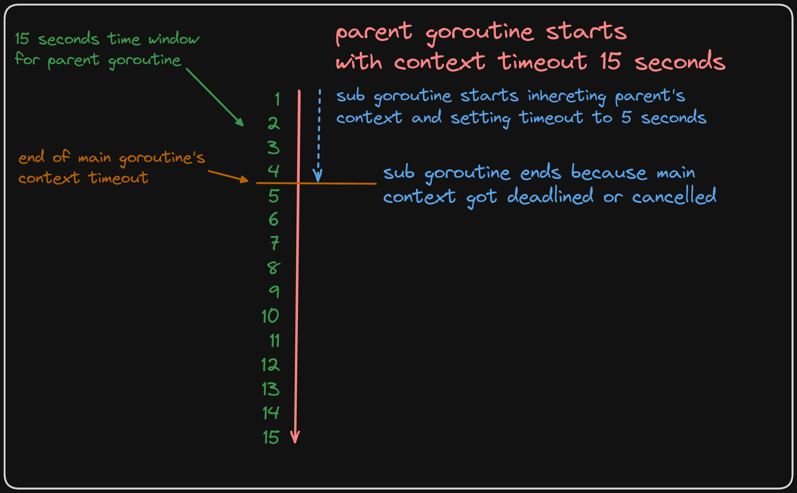
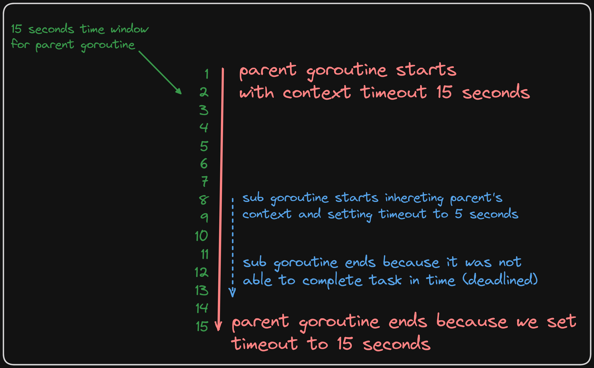
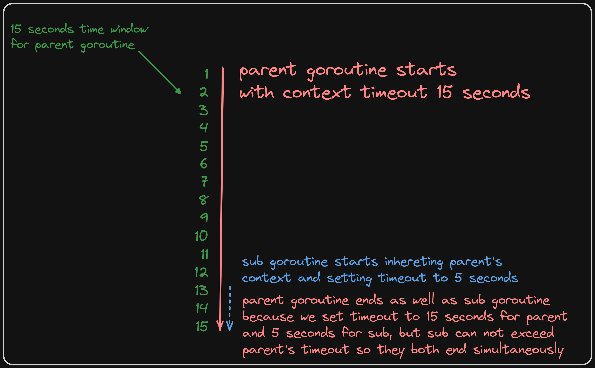

# golang-context-demo
Simple demo how golang derived context works.

For our study, we will create two functions: `parentGoRoutine` and `subGoRoutine`.
The point is to make `parentGoRoutine` last no longer than `ParentContextTimeOut` seconds and `subGoRoutine` no longer than `SubContextTimeOut`.

Imagine `subGoRoutine` calls some very slow function, for example, `slowDBQuery` that never returns, but accepts context as parameter (like most database and/or external api calls).

Next, we will review three cases with different timeouts and start time.

[Official Go Context documentation:](https://pkg.go.dev/context)

    Package context defines the Context type, which carries deadlines,
    cancellation signals, and other request-scoped values across
    API boundaries and between processes.
    
    ...
    
    When a Context is canceled, all Contexts derived from it are also canceled.
    
    ...
    
    The WithCancel, WithDeadline, and WithTimeout functions take a Context (the parent)
    and return a derived Context (the child) and a CancelFunc.
    Calling the CancelFunc cancels the child and its children,
    removes the parent's reference to the child, and stops any associated timers.
    Failing to call the CancelFunc leaks the child and its children
    until the parent is canceled or the timer fires.
    The go vet tool checks that CancelFuncs are used on all control-flow paths.


## Case 1
[Parent context ends earlier than expected](case1/main.go)

As per documentation `When a Context is canceled, all Contexts derived from it are also canceled.`

For this particaular example's sake, we create two timeout variables, one for main context (parent) and one for sub context (child). Say we set it to 15 seconds and 10 seconds. In our case it does not matter if the parent context was cancelled manually or got deadlined, the point is - it stopped for some reason.

We'll get the output:
```Bash
case1$ go run main.go
started parentGoRoutine with timeout 15
started subGoRoutine with timeout 10
Time passed: 1s
Time passed: 2s
Time passed: 3s
parentGoRoutine ended:  context canceled
subGoRoutine ended:  context canceled
Time passed: 4s
Time passed: 5s
...
Time passed: 15s
```
Since out sub goroutine dependent on a parent's context - it gets cancelled at the same time as the main goroutine context stops for any rearon. In this example, main context and sub context starting at the same time, but since main context gets cancelled after 3 seconds - it kills all contexts derived from it.

From documentation:

    Calling the CancelFunc cancels the child and its children, removes the parent's reference to the child, and stops any associated timers. Failing to call the CancelFunc leaks the child and its children until the parent is canceled or the timer fires

This is why sometimes we see a deep context nesting without defer statement. We need to manually controll the flow of data within context and decide whether or not we need to stop.



> [!WARNING]
> Try to put 20 seconds in `default` select branch and output will be completely different =)
> Read more: https://go101.org/article/channel.html#select

## Case 2
[Child's context deadlined somewhere in between parent's context](case2/main.go)

On the opposite to case 1, child's context has little to no meaning for parent's context. If inherited context was not able to process the task in time -- it simply stops without affecting parent's context.

This time we leave timeout variables as it was in case 1 with a little extra waiting time. We want to reproduce situation, where child's context start somewhere in the middle of parent's.

We'll get the output:

```Bash
case2$ go run main.go
started parentGoRoutine with timeout 15
Time passed: 1s
Time passed: 2s
Time passed: 3s
Time passed: 4s
Time passed: 5s
Time passed: 6s
Time passed: 7s
started subGoRoutine with timeout 5
Time passed: 8s
Time passed: 9s
Time passed: 10s
Time passed: 11s
Time passed: 12s
subGoRoutine ended:  context deadline exceeded
Time passed: 13s
Time passed: 14s
parentGoRoutine ended:  context deadline exceeded
Time passed: 15s
```
As we can see, child's context simply gets deadlined while parent's context continues to go on untill it exceeds timeout or finishes the job.




> [!NOTE]
>
> If you think, your database will never be slow, because it has little load and powerful hardware – try to cut some network cables =)

## Case 3

[Child's context starts late and not able to fit in parent's context](case3/main.go)

It might happen that child's contxt starts way too late (close to the parent's deadline) and does not have enough time to finish its job. In that case it gets deadlined at the same time as the parent, not matter how much time it has left.

This time we create even more extra waiting time on child function. We want to reproduce situation, where child's context start somewhere close to the parent's timeout limit, we'll go for 15 seconds for parent and 10 seconds for child, again but with child strating at 13 seconds late.

We'll get the output:

```Bash
case3$ go run main.go
started parentGoRoutine with timeout 15
Time passed: 1s
Time passed: 2s
Time passed: 3s
Time passed: 4s
Time passed: 5s
Time passed: 6s
Time passed: 7s
Time passed: 8s
Time passed: 9s
Time passed: 10s
Time passed: 11s
Time passed: 12s
started subGoRoutine with timeout 10
Time passed: 13s
Time passed: 14s
subGoRoutine ended:  context deadline exceeded
parentGoRoutine ended:  context deadline exceeded
Time passed: 15s
```

As soon as parent's context gets deadlined - child's context gets cancelled immediately.



